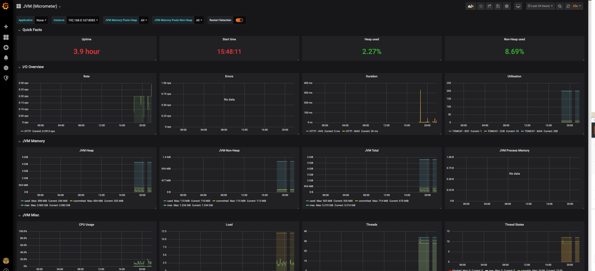

# Finance System

This is a simulation of basic features of a Finance System.
This Architecture has all the feature which should be available in a Cloud Native, Distributed architecture. 

## Functionalities
1. Become Customer
2. Open Account
3. Send money to another customer
4. Take loan

## Functional Road Map
* Customer Service - Done
* Account Service - Done
* Payment Service - Done
* Messaging Layer - Done
1. Create Maven module for different service - DONE
2. Create Customer Service - DONE
3. Create Account Service - DONE
4. Create Payment Service - DONE
5. Payment fail if messaging layer is not available
6. If accounts is not available payments events should be cached and replayed when account is available
7. Loan Service


## Technical Features
* Using DTO
* [MapStruct](https://www.baeldung.com/mapstruct)
* [Using lombok with mapstruck](https://stackoverflow.com/questions/47676369/mapstruct-and-lombok-not-working-togather)
* [Spring Configuration properties](https://www.baeldung.com/configuration-properties-in-spring-boot)
* Application Monitoring using Prometheus and Grafana


## Technical Road Map
5. Rest input Validations
6. Service Matrix - Micrometer
8. Logging
9. Tracing
10. Dockerize each service
11. Db and Redis in its own container
12. Docker compose
13. Kubernets
14. Authentication
15. Jwt token
16. Casandra
17. Deploy the services on Azure
18. Implement Circuit breaker
19. Error Handling
20. Integration Adapter, Configuration
21. Use Flyway

## Cloud Native Features
* Service Discovery
* Load Balancing
* Configuration Management
* Data and state management
* Log Aggregation
* Distributed Tracing - Zipkin
* Fault and Latency tolerance - Circuit Breaker, Hystrix
* Edge Service
* Auto Scaling
* Feature Toggle - ff4j, togglz
* Health Check - Spring boot actuator
* Monitoring Dashboard


# Try it

Currently services can either be run standalone or as docker containers

## Startup sequence
0. config-server
1. messaging-layer
2. account
3. customer
4. payment

## Build All docker files
```mvn clean install -Ddocker-build```

## Run all the docker images
1. ```docker run config-server -p8085:8085```
2. ```docker run messaging-layer -p8085:6379```
3. ```docker run account-service -p8085:8081```
4. ```docker run customer -p8085:8083```
5. ```docker run payment -p8085:8082```


## Test API
[https://documenter.getpostman.com/view/3772012/SVSKKnyZ?version=latest](https://documenter.getpostman.com/view/3772012/SVSKKnyZ?version=latest)


## Application Monitoring
Application Monitoring for this Finance System is done using Prometheus and Grafana. Different metrics from all the service is exposed and periodically scraped by Prometheus.
Grafana is used to visualize these metrics. More details can be found at [Application Monitoring](wiki/Application-Monitoring.md)



##### Inspiration
* [Spring Cloud](http://spring.io/projects/spring-cloud)
* [Tutorial](https://www.devglan.com/spring-cloud/spring-cloud-tutorial)
* [AutoScaling](https://dzone.com/articles/spring-boot-autoscaler)
* https://developers.redhat.com/blog/2017/01/05/architectural-cross-cutting-concerns-of-cloud-native-applications/


