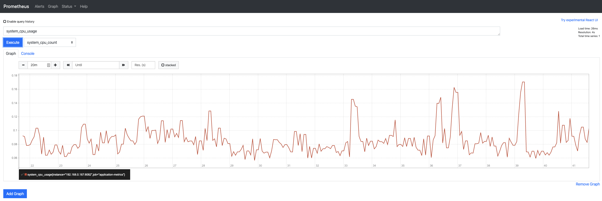
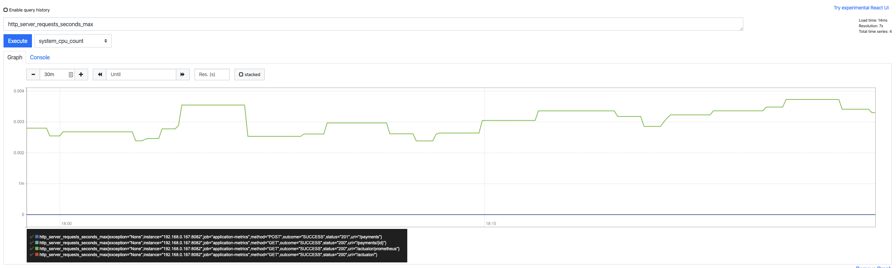
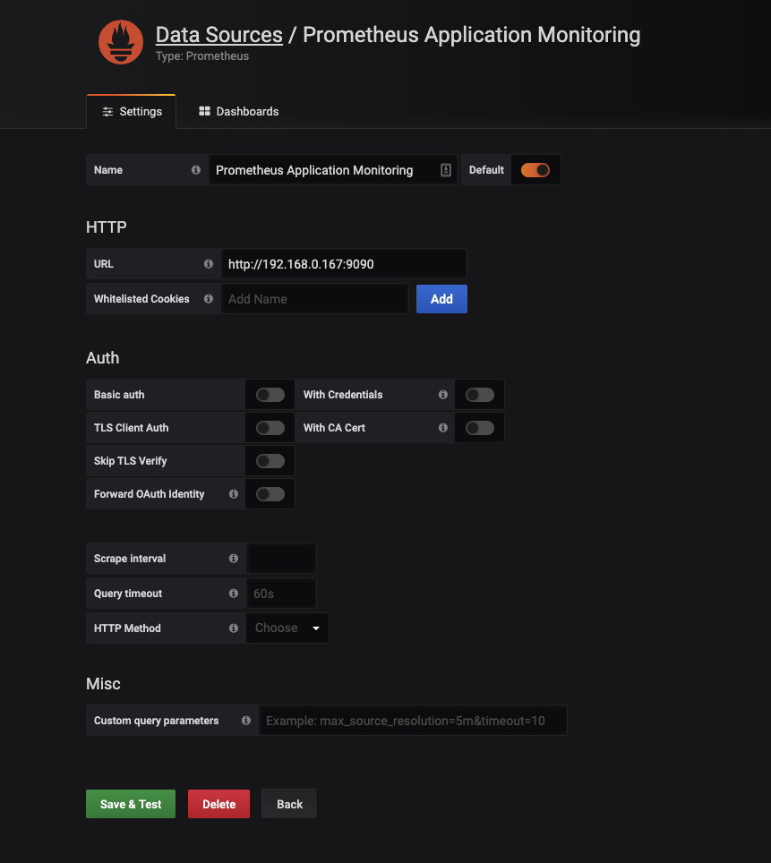
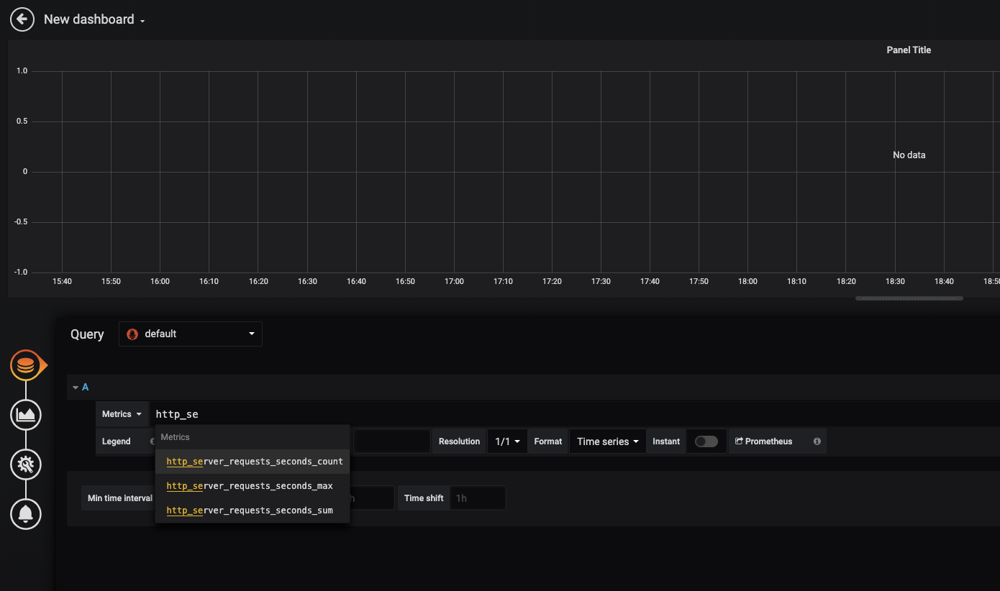
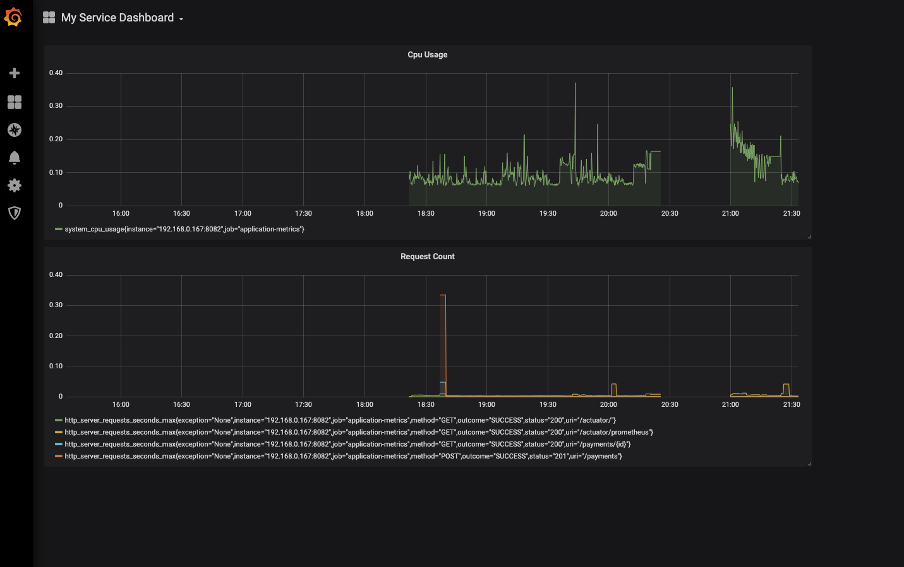

# Application Monitoring

* Spring Actuator
* Prometheus
* Grafana

## Spring Actuator
Spring Boot Actuator module helps you monitor and manage your Spring Boot application by providing production-ready features like health check-up, auditing, metrics gathering, HTTP tracing etc. All of these features can be accessed over JMX or HTTP endpoints.

Actuator also integrates with external application monitoring systems like Prometheus, Graphite, DataDog, Influx, Wavefront, New Relic and many more. These systems provide you with excellent dashboards, graphs, analytics, and alarms to help you monitor and manage your application from one unified interface.

Actuator uses Micrometer, an application metrics facade to integrate with these external application monitoring systems. This makes it super easy to plug-in any application monitoring system with very little configuration.

### Set Up

```xml
<dependencies>
	<dependency>
		<groupId>org.springframework.boot</groupId>
		<artifactId>spring-boot-starter-actuator</artifactId>
	</dependency>
</dependencies>
```


### Testing


Actuator creates several so-called endpoints that can be exposed over HTTP or JMX to let you monitor and interact with your application.

For example, There is a /health endpoint that provides basic information about the application’s health. The /metrics endpoint shows several useful metrics information like JVM memory used, system CPU usage, open files, and much more. The /loggers endpoint shows application’s logs and also lets you change the log level at runtime.

Note that, every actuator endpoint can be explicitly enabled and disabled. Moreover, the endpoints also need to be exposed over HTTP or JMX to make them remotely accessible.

`localhost:8082/actuator`

```json
{
    "_links": {
        "self": {
            "href": "http://localhost:8082/actuator",
            "templated": false
        },
        "health": {
            "href": "http://localhost:8082/actuator/health",
            "templated": false
        },
        "health-component": {
            "href": "http://localhost:8082/actuator/health/{component}",
            "templated": true
        },
        "health-component-instance": {
            "href": "http://localhost:8082/actuator/health/{component}/{instance}",
            "templated": true
        },
        "info": {
            "href": "http://localhost:8082/actuator/info",
            "templated": false
        }
    }
}
```

`http://localhost:8082/actuator/health`

```json
{
    "status": "UP"
}
```
The status will be UP as long as the application is healthy. It will show DOWN if the application gets unhealthy due to any issue like connectivity with the database or lack of disk space etc. 

### Endpoints

By default, only the health and info endpoints are exposed over HTTP. That’s why the /actuator page lists only the health and info endpoints. We’ll learn how to expose other endpoints shortly. First, Let’s see what those endpoints are and what do they offer you.

Following is a list of some super useful actuator endpoints. You can see the complete list on the official documentation.


|Endpoint ID|	|Description|
auditevents	Exposes audit events (e.g. auth_success, order_failed) for your application
info	Displays information about your application.
health	Displays your application’s health status.
metrics	Shows various metrics information of your application.
loggers	Displays and modifies the configured loggers.
logfile	Returns the contents of the log file (if logging.file or logging.path properties are set.)
httptrace	Displays HTTP trace info for the last 100 HTTP request/response.
env	Displays current environment properties.
flyway	Shows details of Flyway database migrations.
liquidbase	Shows details of Liquibase database migrations.
shutdown	Lets you shut down the application gracefully.
mappings	Displays a list of all @RequestMapping paths.
scheduledtasks	Displays the scheduled tasks in your application.
threaddump	Performs a thread dump.
heapdump	Returns a GZip compressed JVM heap dump.

### Enabling Actuator Endpoints

By default, all the endpoints that I listed in the previous section are enabled except the shutdown endpoint.

You can enable or disable an actuator endpoint by setting the property management.endpoint.<id>.enabled to true or false (where id is the identifier for the endpoint).

For example, to enable the shutdown endpoint, add the following to your application.properties file

`management.endpoint.shutdown.enabled=true`

### Exposing Actuator Endpoints

By default, all the actuator endpoints are exposed over JMX but only the health and info endpoints are exposed over HTTP.

Here is how you can expose actuator endpoints over HTTP and JMX using application properties -

```properties
# Use "*" to expose all endpoints, or a comma-separated list to expose selected ones
management.endpoints.web.exposure.include=health,info,prometheus
management.endpoints.web.exposure.exclude=
```

### Securing Actuator Endpoints
Actuator endpoints are sensitive and must be secured from unauthorized access. If Spring Security is present in your application, then the endpoints are secured by default using a form-based HTTP basic authentication.


# Prometheus
Prometheus is an open-source monitoring system that was originally built by SoundCloud. It consists of the following core components -

1. A data scraper that pulls metrics data over HTTP periodically at a configured interval.
2. A time-series database to store all the metrics data.
3. A simple user interface where you can visualize, query, and monitor all the metrics.

## Adding Micrometer Prometheus Registry

Spring Boot uses Micrometer, an application metrics facade to integrate actuator metrics with external monitoring systems.

It supports several monitoring systems like Netflix Atlas, AWS Cloudwatch, Datadog, InfluxData, SignalFx, Graphite, Wavefront, Prometheus etc.

To integrate actuator with Prometheus, you need to add the micrometer-registry-prometheus dependency 

```xml
<dependency>
	<groupId>io.micrometer</groupId>
	<artifactId>micrometer-registry-prometheus</artifactId>
</dependency>
```

Once you add the above dependency, Spring Boot will automatically configure a PrometheusMeterRegistry and a CollectorRegistry to collect and export metrics data in a format that can be scraped by a Prometheus server.

All the application metrics data are made available at an actuator endpoint called /prometheus. The Prometheus server can scrape this endpoint to get metrics data periodically.

`http://localhost:8082/actuator/prometheus`

```json
# HELP jvm_classes_loaded_classes The number of classes that are currently loaded in the Java virtual machine
# TYPE jvm_classes_loaded_classes gauge
jvm_classes_loaded_classes 14250.0
# HELP hikaricp_connections_idle Idle connections
# TYPE hikaricp_connections_idle gauge
hikaricp_connections_idle{pool="HikariPool-1",} 10.0
# HELP tomcat_sessions_alive_max_seconds  
# TYPE tomcat_sessions_alive_max_seconds gauge
tomcat_sessions_alive_max_seconds 0.0
# HELP jvm_threads_peak_threads The peak live thread count since the Java virtual machine started or peak was reset
# TYPE jvm_threads_peak_threads gauge
jvm_threads_peak_threads 34.0
# HELP hikaricp_connections Total connections
# TYPE hikaricp_connections gauge
hikaricp_connections{pool="HikariPool-1",} 10.0
# HELP hikaricp_connections_active Active connections
# TYPE hikaricp_connections_active gauge
hikaricp_connections_active{pool="HikariPool-1",} 0.0
# HELP jvm_gc_memory_allocated_bytes_total Incremented for an increase in the size of the young generation memory pool after one GC to before the next
# TYPE jvm_gc_memory_allocated_bytes_total counter
jvm_gc_memory_allocated_bytes_total 7.47188024E8
# HELP tomcat_threads_config_max_threads  
# TYPE tomcat_threads_config_max_threads gauge
tomcat_threads_config_max_threads{name="http-nio-8082",} 200.0
# HELP jdbc_connections_min  
# TYPE jdbc_connections_min gauge
jdbc_connections_min{name="dataSource",} 10.0
# HELP tomcat_global_received_bytes_total  
# TYPE tomcat_global_received_bytes_total counter
tomcat_global_received_bytes_total{name="http-nio-8082",} 0.0
# HELP tomcat_cache_access_total  
# TYPE tomcat_cache_access_total counter
tomcat_cache_access_total 0.0
# HELP tomcat_sessions_rejected_sessions_total  
# TYPE tomcat_sessions_rejected_sessions_total counter
tomcat_sessions_rejected_sessions_total 0.0
# HELP hikaricp_connections_pending Pending threads
# TYPE hikaricp_connections_pending gauge
hikaricp_connections_pending{pool="HikariPool-1",} 0.0
# HELP tomcat_threads_current_threads  
# TYPE tomcat_threads_current_threads gauge
tomcat_threads_current_threads{name="http-nio-8082",} 10.0
# HELP tomcat_cache_hit_total  
# TYPE tomcat_cache_hit_total counter
tomcat_cache_hit_total 0.0
# HELP jdbc_connections_max  
# TYPE jdbc_connections_max gauge
jdbc_connections_max{name="dataSource",} 10.0
# HELP tomcat_sessions_active_max_sessions  
# TYPE tomcat_sessions_active_max_sessions gauge
tomcat_sessions_active_max_sessions 0.0
# HELP http_server_requests_seconds  
# TYPE http_server_requests_seconds summary
http_server_requests_seconds_count{exception="None",method="GET",outcome="SUCCESS",status="200",uri="/actuator/",} 1.0
http_server_requests_seconds_sum{exception="None",method="GET",outcome="SUCCESS",status="200",uri="/actuator/",} 0.10334049
# HELP http_server_requests_seconds_max  
# TYPE http_server_requests_seconds_max gauge
http_server_requests_seconds_max{exception="None",method="GET",outcome="SUCCESS",status="200",uri="/actuator/",} 0.10334049
# HELP jvm_memory_committed_bytes The amount of memory in bytes that is committed for the Java virtual machine to use
# TYPE jvm_memory_committed_bytes gauge
jvm_memory_committed_bytes{area="nonheap",id="Code Cache",} 2.0119552E7
jvm_memory_committed_bytes{area="nonheap",id="Metaspace",} 7.6152832E7
jvm_memory_committed_bytes{area="nonheap",id="Compressed Class Space",} 1.0616832E7
jvm_memory_committed_bytes{area="heap",id="PS Eden Space",} 3.55467264E8
jvm_memory_committed_bytes{area="heap",id="PS Survivor Space",} 1.7825792E7
jvm_memory_committed_bytes{area="heap",id="PS Old Gen",} 2.48512512E8
# HELP hikaricp_connections_usage_seconds Connection usage time
# TYPE hikaricp_connections_usage_seconds summary
hikaricp_connections_usage_seconds_count{pool="HikariPool-1",} 0.0
hikaricp_connections_usage_seconds_sum{pool="HikariPool-1",} 0.0
# HELP hikaricp_connections_usage_seconds_max Connection usage time
# TYPE hikaricp_connections_usage_seconds_max gauge
hikaricp_connections_usage_seconds_max{pool="HikariPool-1",} 0.0
# HELP process_uptime_seconds The uptime of the Java virtual machine
# TYPE process_uptime_seconds gauge
process_uptime_seconds 21.842
# HELP tomcat_servlet_request_seconds  
# TYPE tomcat_servlet_request_seconds summary
tomcat_servlet_request_seconds_count{name="default",} 0.0
tomcat_servlet_request_seconds_sum{name="default",} 0.0
tomcat_servlet_request_seconds_count{name="dispatcherServlet",} 2.0
tomcat_servlet_request_seconds_sum{name="dispatcherServlet",} 0.15
tomcat_servlet_request_seconds_count{name="webServlet",} 0.0
tomcat_servlet_request_seconds_sum{name="webServlet",} 0.0
# HELP jvm_gc_live_data_size_bytes Size of old generation memory pool after a full GC
# TYPE jvm_gc_live_data_size_bytes gauge
jvm_gc_live_data_size_bytes 4.1067216E7
# HELP process_files_open_files The open file descriptor count
# TYPE process_files_open_files gauge
process_files_open_files 144.0
# HELP tomcat_sessions_active_current_sessions  
# TYPE tomcat_sessions_active_current_sessions gauge
tomcat_sessions_active_current_sessions 0.0
# HELP jvm_gc_max_data_size_bytes Max size of old generation memory pool
# TYPE jvm_gc_max_data_size_bytes gauge
jvm_gc_max_data_size_bytes 2.863661056E9
# HELP hikaricp_connections_acquire_seconds Connection acquire time
# TYPE hikaricp_connections_acquire_seconds summary
hikaricp_connections_acquire_seconds_count{pool="HikariPool-1",} 0.0
hikaricp_connections_acquire_seconds_sum{pool="HikariPool-1",} 0.0
# HELP hikaricp_connections_acquire_seconds_max Connection acquire time
# TYPE hikaricp_connections_acquire_seconds_max gauge
hikaricp_connections_acquire_seconds_max{pool="HikariPool-1",} 0.0
# HELP tomcat_servlet_error_total  
# TYPE tomcat_servlet_error_total counter
tomcat_servlet_error_total{name="default",} 0.0
tomcat_servlet_error_total{name="dispatcherServlet",} 0.0
tomcat_servlet_error_total{name="webServlet",} 0.0
# HELP jvm_memory_max_bytes The maximum amount of memory in bytes that can be used for memory management
# TYPE jvm_memory_max_bytes gauge
jvm_memory_max_bytes{area="nonheap",id="Code Cache",} 2.5165824E8
jvm_memory_max_bytes{area="nonheap",id="Metaspace",} -1.0
jvm_memory_max_bytes{area="nonheap",id="Compressed Class Space",} 1.073741824E9
jvm_memory_max_bytes{area="heap",id="PS Eden Space",} 1.389887488E9
jvm_memory_max_bytes{area="heap",id="PS Survivor Space",} 1.7825792E7
jvm_memory_max_bytes{area="heap",id="PS Old Gen",} 2.863661056E9
# HELP jvm_buffer_count_buffers An estimate of the number of buffers in the pool
# TYPE jvm_buffer_count_buffers gauge
jvm_buffer_count_buffers{id="direct",} 6.0
jvm_buffer_count_buffers{id="mapped",} 0.0
# HELP process_cpu_usage The "recent cpu usage" for the Java Virtual Machine process
# TYPE process_cpu_usage gauge
process_cpu_usage 0.0
# HELP jvm_buffer_total_capacity_bytes An estimate of the total capacity of the buffers in this pool
# TYPE jvm_buffer_total_capacity_bytes gauge
jvm_buffer_total_capacity_bytes{id="direct",} 32770.0
jvm_buffer_total_capacity_bytes{id="mapped",} 0.0
# HELP jdbc_connections_active  
# TYPE jdbc_connections_active gauge
jdbc_connections_active{name="dataSource",} 0.0
# HELP jvm_threads_daemon_threads The current number of live daemon threads
# TYPE jvm_threads_daemon_threads gauge
jvm_threads_daemon_threads 28.0
# HELP tomcat_global_request_seconds  
# TYPE tomcat_global_request_seconds summary
tomcat_global_request_seconds_count{name="http-nio-8082",} 1.0
tomcat_global_request_seconds_sum{name="http-nio-8082",} 0.171
# HELP system_cpu_count The number of processors available to the Java virtual machine
# TYPE system_cpu_count gauge
system_cpu_count 12.0
# HELP tomcat_global_sent_bytes_total  
# TYPE tomcat_global_sent_bytes_total counter
tomcat_global_sent_bytes_total{name="http-nio-8082",} 720.0
# HELP process_start_time_seconds Start time of the process since unix epoch.
# TYPE process_start_time_seconds gauge
process_start_time_seconds 1.578926891839E9
# HELP tomcat_servlet_request_max_seconds  
# TYPE tomcat_servlet_request_max_seconds gauge
tomcat_servlet_request_max_seconds{name="default",} 0.0
tomcat_servlet_request_max_seconds{name="dispatcherServlet",} 0.15
tomcat_servlet_request_max_seconds{name="webServlet",} 0.0
# HELP logback_events_total Number of error level events that made it to the logs
# TYPE logback_events_total counter
logback_events_total{level="error",} 0.0
logback_events_total{level="warn",} 1.0
logback_events_total{level="info",} 25.0
logback_events_total{level="debug",} 0.0
logback_events_total{level="trace",} 0.0
# HELP tomcat_sessions_expired_sessions_total  
# TYPE tomcat_sessions_expired_sessions_total counter
tomcat_sessions_expired_sessions_total 0.0
# HELP jvm_classes_unloaded_classes_total The total number of classes unloaded since the Java virtual machine has started execution
# TYPE jvm_classes_unloaded_classes_total counter
jvm_classes_unloaded_classes_total 1.0
# HELP hikaricp_connections_timeout_total Connection timeout total count
# TYPE hikaricp_connections_timeout_total counter
hikaricp_connections_timeout_total{pool="HikariPool-1",} 0.0
# HELP tomcat_sessions_created_sessions_total  
# TYPE tomcat_sessions_created_sessions_total counter
tomcat_sessions_created_sessions_total 0.0
# HELP jvm_gc_memory_promoted_bytes_total Count of positive increases in the size of the old generation memory pool before GC to after GC
# TYPE jvm_gc_memory_promoted_bytes_total counter
jvm_gc_memory_promoted_bytes_total 2.2987304E7
# HELP system_load_average_1m The sum of the number of runnable entities queued to available processors and the number of runnable entities running on the available processors averaged over a period of time
# TYPE system_load_average_1m gauge
system_load_average_1m 2.23828125
# HELP hikaricp_connections_max Max connections
# TYPE hikaricp_connections_max gauge
hikaricp_connections_max{pool="HikariPool-1",} 10.0
# HELP tomcat_global_error_total  
# TYPE tomcat_global_error_total counter
tomcat_global_error_total{name="http-nio-8082",} 0.0
# HELP jvm_gc_pause_seconds Time spent in GC pause
# TYPE jvm_gc_pause_seconds summary
jvm_gc_pause_seconds_count{action="end of minor GC",cause="Allocation Failure",} 2.0
jvm_gc_pause_seconds_sum{action="end of minor GC",cause="Allocation Failure",} 0.02
jvm_gc_pause_seconds_count{action="end of minor GC",cause="Metadata GC Threshold",} 1.0
jvm_gc_pause_seconds_sum{action="end of minor GC",cause="Metadata GC Threshold",} 0.016
jvm_gc_pause_seconds_count{action="end of major GC",cause="Metadata GC Threshold",} 1.0
jvm_gc_pause_seconds_sum{action="end of major GC",cause="Metadata GC Threshold",} 0.106
# HELP jvm_gc_pause_seconds_max Time spent in GC pause
# TYPE jvm_gc_pause_seconds_max gauge
jvm_gc_pause_seconds_max{action="end of minor GC",cause="Allocation Failure",} 0.012
jvm_gc_pause_seconds_max{action="end of minor GC",cause="Metadata GC Threshold",} 0.016
jvm_gc_pause_seconds_max{action="end of major GC",cause="Metadata GC Threshold",} 0.106
# HELP hikaricp_connections_min Min connections
# TYPE hikaricp_connections_min gauge
hikaricp_connections_min{pool="HikariPool-1",} 10.0
# HELP system_cpu_usage The "recent cpu usage" for the whole system
# TYPE system_cpu_usage gauge
system_cpu_usage 0.0
# HELP jvm_threads_states_threads The current number of threads having NEW state
# TYPE jvm_threads_states_threads gauge
jvm_threads_states_threads{state="new",} 0.0
jvm_threads_states_threads{state="runnable",} 10.0
jvm_threads_states_threads{state="blocked",} 0.0
jvm_threads_states_threads{state="waiting",} 12.0

```

## Running Prometheus locally
You can download the Prometheus docker image using docker pull command

```docker pull prom/prometheus```

#### Prometheus Configuration
Next, We need to configure Prometheus to scrape metrics data from Spring Boot Actuator’s /prometheus endpoint.

Create a new file called prometheus.yml with the following configurations

```yaml
# my global config
global:
  scrape_interval:     10s # Set the scrape interval to every 10 seconds. Default is every 1 minute.
  evaluation_interval: 10s # Evaluate rules every 10 seconds. The default is every 1 minute.
  # scrape_timeout is set to the global default (10s).

# Load rules once and periodically evaluate them according to the global 'evaluation_interval'.
rule_files:
# - "first_rules.yml"
# - "second_rules.yml"

# A scrape configuration containing exactly one endpoint to scrape:
# Here it's Prometheus itself.
scrape_configs:
  # The job name is added as a label `job=<job_name>` to any timeseries scraped from this config.
  - job_name: 'prometheus'
    # metrics_path defaults to '/metrics'
    # scheme defaults to 'http'.
    static_configs:
      - targets: ['127.0.0.1:9090']

  - job_name: 'application-metrics'
    metrics_path: '/actuator/prometheus'
    scrape_interval: 5s
    static_configs:
      - targets: ['192.168.0.167:8081','192.168.0.167:8082','192.168.0.167:8083']
```

The above configuration file is an extension of the basic configuration file available in the Prometheus documentation.

The most important stuff to note in the above configuration file is the spring-actuator job inside scrape_configs section.

The metrics_path is the path of the Actuator’s prometheus endpoint. The targets section contains the HOST and PORT of your Spring Boot application.

Please make sure to replace the HOST_IP with the IP address of the machine where your Spring Boot application is running. Note that, localhost won’t work here because we’ll be connecting to the HOST machine from the docker container. You must specify the network IP address.

### Running Prometheus using Docker
Type the following command to start a Prometheus server in the background 

```jshelllanguage
docker run -d --name=prometheus -p 9090:9090 -v <PATH_TO_prometheus.yml_FILE>:/etc/prometheus/prometheus.yml prom/prometheus --config.file=/etc/prometheus/prometheus.yml
```
Please make sure to replace the <PATH_TO_prometheus.yml_FILE> with the PATH where you have stored the Prometheus configuration file.

After running the above command, docker will start the Prometheus server inside a container. You can see the list of all the containers with the following command

```jshelllanguage
docker container ls                                                            
CONTAINER ID        IMAGE               COMMAND                  CREATED             STATUS              PORTS                    NAMES
3dff46b443cd        prom/prometheus     "/bin/prometheus --c…"   6 minutes ago       Up 6 minutes        0.0.0.0:9090->9090/tcp   prometheus
```

### Prometheus Dashboard

That’s it! You can now navigate to http://localhost:9090 to explore the Prometheus dashboard.

You can enter a Prometheus query expression inside the Expression text field and visualize all the metrics for that query.

Following are some Prometheus graphs for our Spring Boot application’s metrics -

#### System’s CPU usage


#### Http API request per second


You can check out the official Prometheus documentation to learn more about [Prometheus Query Expressions](https://prometheus.io/docs/prometheus/latest/querying/examples).

# Grafana

Grafana allows you to bring data from various data sources like Elasticsearch, Prometheus, Graphite, InfluxDB etc, and visualize them with beautiful graphs.

It also lets you set alert rules based on your metrics data. When an alert changes state, it can notify you over email, slack, or various other channels.

## Run Grafana locally

Run below command to download and run Grafana with Docker
```jshelllanguage
docker run -d --name=grafana -p 3000:3000 grafana/grafana 
```

You can now navigate to http://localhost:3000 and log in to Grafana with the default username admin and password admin.

### Adding Prometheus Data source


### Create your own Dashboard


### Monitoring Dashboard


### Importing Dashboard
There are many dashboard available at [grafana website](https://grafana.com/grafana/dashboards). 
You can save the hassle and import already available dashboards. One such awesome dashboard is [jvm dashboard](https://grafana.com/grafana/dashboards/4701) for Spring Boot micrometer applications.


#### Reference
* https://www.callicoder.com/spring-boot-actuator
* https://dev.to/lynn/monitoring-an-api-with-prometheus-and-grafana-using-spring-boot-actuator-46hi
* https://stackabuse.com/monitoring-spring-boot-apps-with-micrometer-prometheus-and-grafana/
* https://www.callicoder.com/spring-boot-actuator-metrics-monitoring-dashboard-prometheus-grafana/